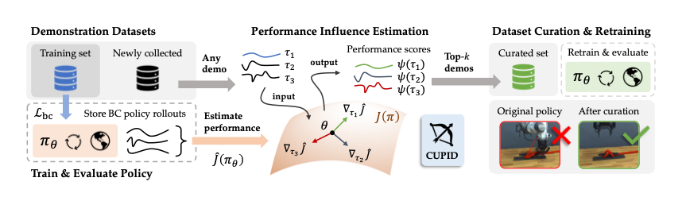

# [CUPID] Curating Data your Robot Loves with Influence Functions 💘

[Christopher Agia](https://www.chrisagia.com/)<sup>1</sup>,
[Rohan Sinha](https://rohansinha.nl/)<sup>1</sup>,
[Jingyun Yang](https://yjy0625.github.io/)<sup>1</sup>,
[Rika Antonova](https://contactrika.github.io/)<sup>2</sup>,
[Marco Pavone](https://profiles.stanford.edu/marco-pavone)<sup>1,3</sup>,
[Haruki Nishimura](https://harukins.github.io/)<sup>4</sup>,
[Masha Itkina](https://mashaitkina.weebly.com/)<sup>4</sup>,
[Jeannette Bohg](https://web.stanford.edu/~bohg/)<sup>1</sup>

<sup>1</sup>Stanford University,
<sup>2</sup>University of Cambridge,
<sup>3</sup>NVIDIA Research,
<sup>4</sup>Toyota Research Institute

<a href='https://cupid-curation.github.io/'></a> <a href='https://arxiv.org/abs/2506.19121'></a> [](https://www.youtube.com/watch?v=0kmIiEjTqV8)

The official code repository for *"CUPID: Curating Data your Robot Loves with Influence Functions,"* accepted to CoRL 2025.
For a brief overview of our work, please refer to our [project page](https://cupid-curation.github.io/).
Further details can be found in our paper available on [arXiv](https://arxiv.org/abs/2506.19121).




## Overview 🗺️
This repository implements a four-stage, end-to-end data curation pipeline for robot imitation learning policies, built atop the official diffusion policy [codebase](https://github.com/real-stanford/diffusion_policy):
1. 🏗️ [Train initial policies on uncurated data](#stage-1-train-policies-on-uncurated-data-️)
2. 🤖 [Evaluate initial policies and store rollout trajectories](#stage-2-evaluate-policies-to-collect-rollouts-)
3. 🎯 [Run data curation with CUPID and analyze curated data quality](#stage-3-curate-data-with-cupid-)
4. 📈 [Re-train policies on curated data and analyze performance](#stage-4-re-train-policies-on-curated-data-)


#### What's included? 🗂️
- The official implementation of CUPID and core influence function routines for diffusion policies.
- Data curation support (both **data filtering** and **data selection**) for PushT and [RoboMimic](https://robomimic.github.io/) environments.
- A suite of data curation methods spanning **offline** and **online** (i.e., requiring [policy evaluation](#stage-2-evaluate-policies-to-collect-rollouts-)) approaches.


## Quick Start 🏁
This repository is tested on Ubuntu 20.04 with Python 3.9.15. Follow the installation procedure below to get setup.

### Installation 🛠️

**Conda:** Python packages are managed through Conda. We recommend using **Miniconda** with **Mamba** for faster and more robust package management (as in [diffusion policy](https://github.com/real-stanford/diffusion_policy?tab=readme-ov-file#%EF%B8%8F-installation)), and we provide Mamba setup instructions [here](https://github.com/agiachris/cupid/blob/main/readme/install_mamba.md). 

**MuJoCo:** Next, please follow these [instructions](https://github.com/openai/mujoco-py) to install the original version of `mujoco210` for Linux. If you run into trouble, you can try our provided instructions [here](https://github.com/agiachris/cupid/blob/main/readme/install_mujoco.md).

**Virtualenv:** Finally, create the Python virtual environment using `mamba` (note: `conda` might halt):
```bash
# Clone repository.
git clone https://github.com/agiachris/cupid.git --recursive
cd cupid

# Create and activate virtualenv.
mamba env create -f conda_environment.yaml
conda activate cupid

# Replace free-mujoco-py with mujoco-py.
pip uninstall free-mujoco-py 
pip install mujoco-py==2.1.2.14

# Login to wandb.
wandb login
```

### Datasets 📂
Instructions for downloading the official diffusion policy training [datasets](https://diffusion-policy.cs.columbia.edu/data/training/) can be found [here](https://github.com/real-stanford/diffusion_policy?tab=readme-ov-file#download-training-data). See an example for downloading Robomimic low-dimensional "state" datasets below:
```bash
mkdir data && cd data
wget https://diffusion-policy.cs.columbia.edu/data/training/robomimic_lowdim.zip
unzip robomimic_lowdim.zip && rm -f robomimic_lowdim.zip && cd ..
```
The training data will be accessible under `data/robomimic/datasets`. The corresponding training configs can be found at `configs/low_dim`.


## Curating Performance-Influencing Demonstrations (CUPID)

#### Running Experiments: Key Details 🔔 
Experiments are launched through shell (`.sh`) scripts. These scripts make it easy to parallelize experiments on a SLURM-managed cluster. Before launching an experiment, you’ll need to update a few key variables in the script:
- `DEBUG=1` – set to 0 to run the experiment, or 1 to print the Python command without executing it.
- `SLURM_HOSTNAME="<enter_hostname>"` – specify the hostname of your SLURM cluster's submit node.
- `SLURM_SBATCH_FILE="<enter_sbatch_file>"` – specify the path to your SLURM batch submission script.
- Additional variables required for specific experiments are documented in the sections below (see 🔎).

> 💡 **Note:** If SLURM is not available, the script will default to running jobs sequentially on the local machine.

To serve as an example, all provided shell scripts are pre-configured to run the RoboMimic Lift MH task using the CNN-based Diffusion Policy, and all experiments are repeated over three random seeds per task. You can use these templates and modify them for other tasks or datasets as needed. 

### Stage 1: Train Policies on Uncurated Data 🏗️
Run the following to train a policy on a random subset of uncurated data. Repeated over three random seeds.

<details>
<summary>See key variables 🔎</summary>

- Set `date="<enter_date>"` to the current "train" date. Used to name output training directories.
- Option: Configure initial training dataset for demo filtering (**Task 1**) or demo selection (**Task 2**) experiments. Please refer to Section 4 of the [paper](https://arxiv.org/pdf/2506.19121) for formal definitions of these two (**Task 1** and **Task 2**) curation settings.
    - Set `train_filter=1` and `train_select=0` to configure the training dataset for demo filtering. 
    - Set `train_filter=0` and `train_select=1` to configure the training dataset for demo selection. 
    > 💡 Note: All subsequent experiment instructions assume one of the two settings above. To prevent overwriting policy checkpoints, use a different `date` for demo filtering and demo selection experiments.
</details>

```bash
bash scripts/train/train_policies.sh
```
Training checkpoints will be saved to `data/outputs/train`.

### Stage 2: Evaluate Policies to Collect Rollouts 🤖
Run the following to evaluate the policy and save rollout trajectories. Repeated over three random seeds.

<details>
<summary>See key variables 🔎</summary>

- Set `date="<enter_date>"` to the current "eval" date. Used to name output evaluation directories.
- Set `train_date="<enter_policy_train_date>"` to the "train" date set in [Stage 1](#stage-1-train-policies-on-uncurated-data-️).
</details>

```bash
bash scripts/eval/eval_save_episodes.sh
```
Evaluation results will be saved to `data/outputs/eval_save_episodes`.

### Stage 3: Curate Data with CUPID 🎯

#### 3.1 – Estimate Action Influences
First, compute the influence of each training state-action pair on all test state-action pairs observed in rollouts. 

<details>
<summary>See key variables 🔎</summary>

- Set `train_date="<enter_policy_train_date>"` to the "train" date set in [Stage 1](#stage-1-train-policies-on-uncurated-data-️).
- Set `eval_date="<enter_policy_eval_date>"` to the "eval" date set in [Stage 2](#stage-2-evaluate-policies-to-collect-rollouts-).
</details>

```bash
bash scripts/train/train_trak.sh
```
The resulting _action influence_ scores will be saved to the corresponding policy's evaluation directory.

#### 3.2 – Compute Performance Influences
Next, compute the _performance influence_ of each training demo by aggregating influences of state-action pairs.

<details>
<summary>See key variables 🔎</summary>

- Set `train_date="<enter_policy_train_date>"` to the "train" date set in [Stage 1](#stage-1-train-policies-on-uncurated-data-️).
- Set `eval_date="<enter_policy_eval_date>"` to the "eval" date set in [Stage 2](#stage-2-evaluate-policies-to-collect-rollouts-).
- Set `eval_online_trak_influence=1` to enable demonstration scoring based on influence scores.
</details>

```bash
bash scripts/eval/eval_demonstration_scores.sh
```
The resulting _performance influence_ scores will be saved to the corresponding policy's evaluation directory.

#### 3.3 – Generate Re-training Configs
Before re-training the policy on curated data, we need to generate a config file that rank-orders training demos based on their computed scores in [Stage 3.2](#32--compute-performance-influences). **The notebook [`notebooks/data_curation.ipynb`](https://github.com/agiachris/cupid/blob/main/notebooks/data_curation.ipynb)** implements the logic for doing so. Run the cells in `Sec 1` of the notebook to get started.
1. To visualize data quality trends for demo filtering (resp., selection), run cell `Sec 2.1` (resp., `Sec 2.2`).
2. To generate re-training configs for demo filtering (resp., selection), run cell `Sec 3.1` (resp., `Sec 3.2`).

Configs for re-training the policy on curated data will be saved to `configs/curation`.

### Stage 4: Re-train Policies on Curated Data 📈
Run the following to re-train the policy on curated data; using the re-training config generated in [Stage 3.3](#33--generate-re-training-configs).

<details>
<summary>See key variables 🔎</summary>

- Set `date="<enter_date>"` to the current "retrain" date. Used to name output re-training directories.
- The script is pre-configured to filter 10%-90% of the training data and select 0% of the holdout data. You can adjust `curation_filter_ratios` and `curation_select_ratios` according to your specific curation needs.
</details>

```bash
bash scripts/train/retrain_policies.sh
```

Once the policy has finished training, open `notebooks/data_curation.ipynb` and run cell `Sec 4.1` (resp., `Sec 4.2`) to visualize policy performance trends for demo filtering (resp., demo selection).


## Data Curation Baselines 🦾

**Important Note:** Provided instructions for running baselines assume that policies have been trained and evaluated following [Stage 1](#stage-1-train-policies-on-uncurated-data-️) and [Stage 2](#stage-2-evaluate-policies-to-collect-rollouts-) above. See Appendix B.4 in the [paper](https://arxiv.org/pdf/2506.19121) for a description of our baselines.

### DemInf
We use DemInf's [official code](https://github.com/jhejna/demonstration-information) directly and refer to their usage instructions.

### Demo-SCORE
We recommend using Demo-SCORE's [official code](https://github.com/alessing/demo-score?tab=readme-ov-file), which was released after our custom implementation:
```bash
bash scripts/eval/eval_save_episodes.sh         # Set `train_demoscore=1`.
bash scripts/train/train_demo_score.sh          # Set relevant "train" and "eval" `dates`.
bash scripts/eval/eval_demo_score.sh            # Set relevant "train" and "eval" `dates`.
bash scripts/eval/eval_demonstration_scores.sh  # Set `eval_online_demo_score=1`.
```
Proceed to [Stage 3.3](#33--generate-re-training-configs), uncommenting `Demo-SCORE` in `notebooks/data_curation.ipynb` where present. Then, follow [Stage 4](#stage-4-re-train-policies-on-curated-data-) instructions, uncommenting `demoscore` in `scripts/train/retrain_policies.sh`.

### Success Similarity
```bash
bash scripts/eval/eval_embeddings.sh            # Set relevant "train" and "eval" `dates`.
bash scripts/eval/eval_demonstration_scores.sh  # Set `eval_online_state_similarity=1`.
```
Proceed to [Stage 3.3](#33--generate-re-training-configs), uncommenting `Success Similarity` in `notebooks/data_curation.ipynb` where present. Then, follow [Stage 4](#stage-4-re-train-policies-on-curated-data-) instructions, uncommenting `state_similarity` in `scripts/train/retrain_policies.sh`.

### State Diversity
```bash
bash scripts/eval/eval_embeddings.sh            # Set relevant "train" and "eval" `dates`.
bash scripts/eval/eval_demonstration_scores.sh  # Set `eval_offline_state_diversity=1`.
```
Proceed to [Stage 3.3](#33--generate-re-training-configs), uncommenting `State Diversity` in `notebooks/data_curation.ipynb` where present. Then, follow [Stage 4](#stage-4-re-train-policies-on-curated-data-) instructions, uncommenting `state_diversity` in `scripts/train/retrain_policies.sh`.

### Action Diversity
```bash
bash scripts/eval/eval_action_variance.sh       # Set relevant "train" and "eval" `dates`.
bash scripts/eval/eval_demonstration_scores.sh  # Set `eval_offline_action_diversity=1`.
```
Proceed to [Stage 3.3](#33--generate-re-training-configs), uncommenting `Action Diversity` in `notebooks/data_curation.ipynb` where present. Then, follow [Stage 4](#stage-4-re-train-policies-on-curated-data-) instructions, uncommenting `action_diversity` in `scripts/train/retrain_policies.sh`.

### Policy Loss
```bash
bash scripts/eval/eval_policy_loss.sh           # Set relevant "train" and "eval" `dates`.
bash scripts/eval/eval_demonstration_scores.sh  # Set `eval_offline_policy_loss=1`.
``` 
Proceed to [Stage 3.3](#33--generate-re-training-configs), uncommenting `Policy Loss` in `notebooks/data_curation.ipynb` where present. Then, follow [Stage 4](#stage-4-re-train-policies-on-curated-data-) instructions, uncommenting `policy_loss` in `scripts/train/retrain_policies.sh`.


---
## Citation 🏷️
CUPID is offered under the [MIT License](https://github.com/agiachris/cupid/blob/main/LICENSE) agreement. 
If you find CUPID useful, please consider citing our work:
```
@article{agia2025cupid,
    title   = {CUPID: Curating Data your Robot Loves with Influence Functions},
    author  = {Agia, Christopher and Sinha, Rohan and Yang, Jingyun and Antonova, Rika and Pavone, Marco and Nishimura, Haruki and Itkina, Masha and Bohg, Jeannette},
    year    = 2025,
    journal = {arXiv preprint arXiv:2506.19121}
}
```

#### Acknowledgements 🙏
- Our repository is built atop the official [Diffusion Policy](https://github.com/real-stanford/diffusion_policy) repository.
- Our influence function routines are adapted from [TRAK](https://github.com/MadryLab/trak).
